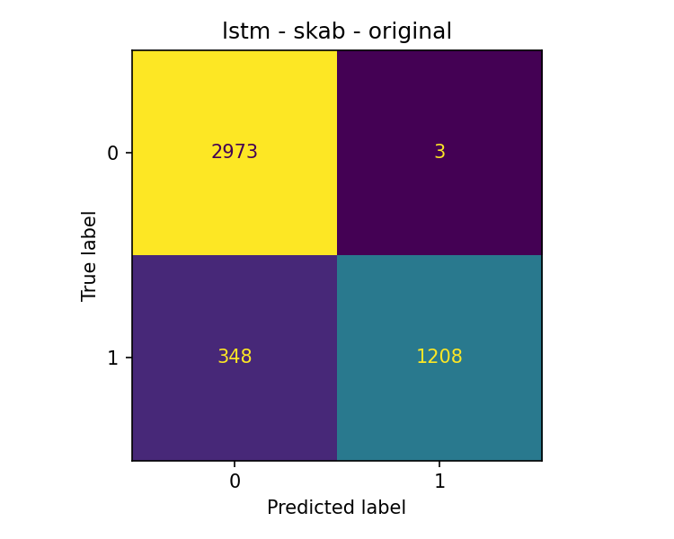
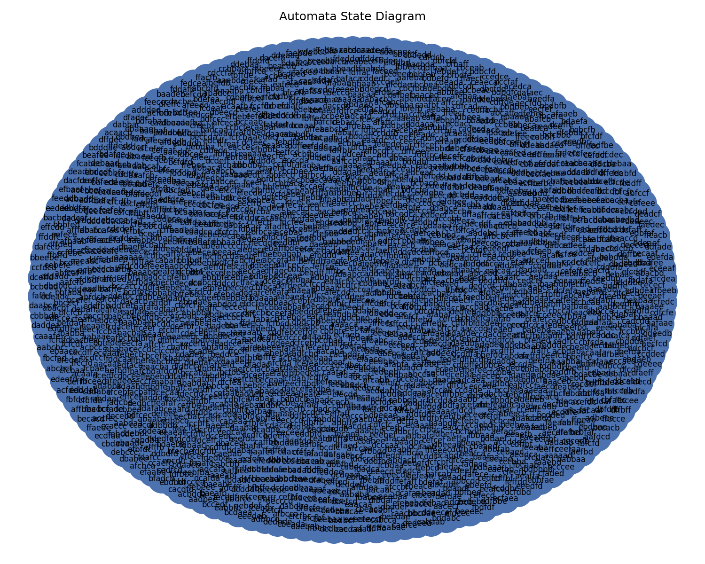
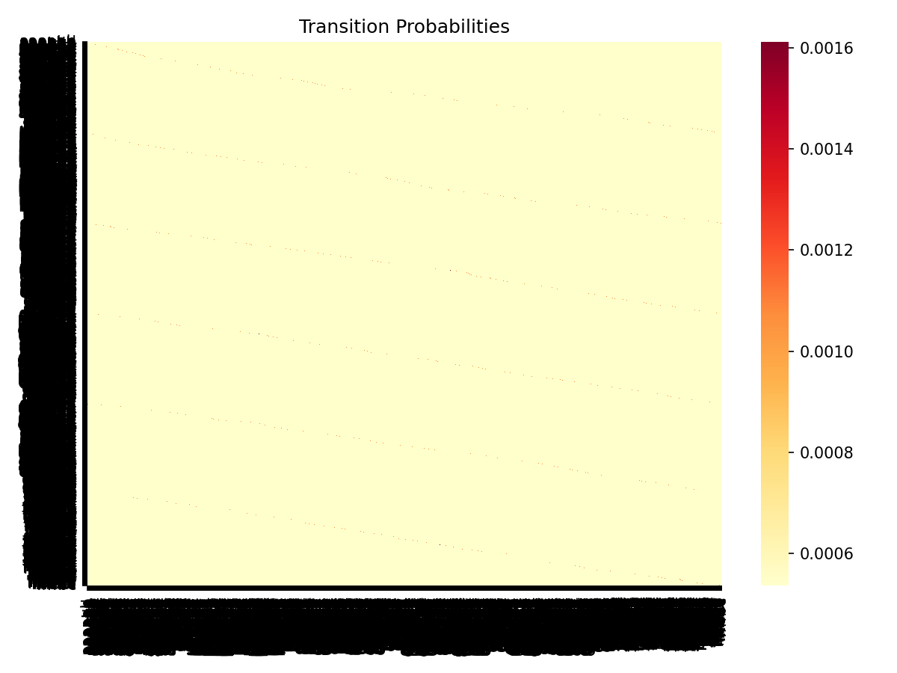

# YazLab 2 — From Black-Box to Explainability: Probabilistic Automata for Time Series Analysis

**Grup:** [Grup numaranızı ekleyin]  
**Son güncelleme:** 5 Haziran 2026

**Tarih:** 6 Haziran 2026  
**Teslim:** 7 Haziran 2026, 23:59

---

## 1. Giriş

Zaman serisi verileri finans, biyomedikal, IoT ve siber güvenlik gibi alanlarda yaygın kullanılmaktadır. Bu projede anomali tespiti problemi, iki farklı modelleme paradigması üzerinden ele alınmıştır:

1. **Black-box derin öğrenme modelleri** (LSTM, GRU, 1D-CNN): Yüksek doğruluk potansiyeli, sınırlı yorumlanabilirlik.
2. **Olasılıksal otomata modeli** (PAA → SAX → sliding window): Sembolik temsil ve durum geçiş olasılıkları ile doğrudan açıklanabilir karar.

Araştırma sorusu: *Farklı modelleme yaklaşımları, zaman serisi verileri üzerinde farklı veri koşulları (orijinal, gürültülü, unseen) altında nasıl davranmaktadır ve bu farklar istatistiksel olarak anlamlı mıdır?*

Proje yalnızca en iyi modeli seçmekten ziyade; performans, genellenebilirlik, gürültüye dayanıklılık ve açıklanabilirlik kriterlerini sistematik biçimde karşılaştırmayı hedefler.

---

## 2. Veri Setleri ve Kullanım Kuralları

### 2.1 SKAB

| Özellik | Değer |
|---------|-------|
| Kaynak | [anomaly-detection-skab](https://github.com/waico/skab) |
| Kullanılan klasörler | `valve1/`, `valve2/` |
| Birleştirme | Tüm CSV dosyaları `concat`; `source_group`, `source_file` metadata sütunları eklendi |
| Hedef değişken | `anomaly` (0=normal, 1=anomali) |
| Model girdisi | Sensör sütunları (`datetime`, `changepoint`, metadata hariç) |
| Değerlendirme | `StratifiedGroupKFold` (5 fold), grup = `source_file` |

### 2.2 BATADAL

| Özellik | Değer |
|---------|-------|
| Kaynak | [batadal.net](https://www.batadal.net/data.html) |
| Kullanılan dosya | **`BATADAL_dataset04.csv` (Training Dataset 2)** |
| Kullanılmayan | Training Dataset 1 (`dataset03`, yalnızca normal), Test Dataset (etiketsiz) |
| Hedef değişken | **`ATT_FLAG`** — `1`=saldırı, `-999`=etiketsiz → normal (`0`) kabul edildi |
| Model girdisi | SCADA sensör sütunları (`DATETIME` hariç) |
| Değerlendirme | Zaman sıralı **%60 train / %20 val / %20 test** |

---

## 3. Metodoloji

### 3.1 Ön İşleme

- **Eksik veri:** Median imputation (`SimpleImputer`, train-only fit)
- **Normalizasyon:** `StandardScaler` (train-only fit)
- **PCA:** Otomata için tüm sensörler → PC1 tek boyut (train-only fit)
- **DL girdi:** Normalize çok boyutlu sensör dizisi + sliding window (`sequence_length=10`)

**Data leakage önleme:** Scaler, PCA, SAX sözlüğü ve otomata geçiş olasılıkları yalnızca eğitim verisinde fit edilir; validation/test'e yalnızca transform uygulanır.

### 3.2 Derin Öğrenme Modelleri

| Parametre | Değer |
|-----------|-------|
| Modeller | LSTM, GRU, 1D-CNN |
| Epoch üst sınırı | 50 |
| Batch size | 32 |
| Early stopping | Validation loss, patience=5 |
| Learning rate | 0.001 |
| Random seeds | 42, 123, 2026, 7, 999 |
| Sınıf dengesizliği | `pos_weight` (BATADAL için) |
| Eşik | Validation F1 ile otomatik tuning |

### 3.3 Olasılıksal Otomata

```
PC1 serisi → PAA (segment_size=8) → SAX (alphabet_size) → Sliding Window (window_size) → Pattern (state)
Geçiş olasılığı: P(Si→Sj) = count(Si→Sj) / total_out(Si)  [Laplace smoothing, α=1]
Path probability: P(sequence) = ∏ P(Si→Si+1)
Karar: path_probability < threshold → ANOMALY
```

**Sabit karşılaştırma parametreleri:** window=4, alphabet=3  
**Parametre sweep:** window ∈ {3,4,5,6}, alphabet ∈ {3,4,5,6}

### 3.4 Unseen Pattern Yönetimi

Test sırasında train SAX sözlüğünde bulunmayan pattern'lar `unseen` olarak işaretlenir. **Levenshtein (Edit Distance)** ile en yakın train pattern bulunur ve sistem bu state üzerinden devam eder. Bu mekanizma `tests/` altında birim testlerle doğrulanmıştır.

### 3.5 Deney Senaryoları

| Senaryo | Açıklama |
|---------|----------|
| `original` | Temiz (ön işlenmiş) veri |
| `noisy` | Gaussian gürültü (`std=0.1`) |
| `unseen` | Otomata için unseen pattern metrikleri (mapping accuracy, unseen count) |

---

## 4. Yazılım Mimarisi

Tüm parametreler `config/config.yaml` dosyasında merkezi olarak tutulur. Veri yükleme, ön işleme, modelleme ve değerlendirme modüler pipeline yapısında tasarlanmıştır:

```
config/config.yaml → src/data/ → src/preprocessing/ → src/models/ → src/evaluation/
                              ↘ experiments/run_experiment.py
```

Parametre değişikliği config üzerinden yapılır; hard-coded değer kullanılmaz.

---

## 5. Olasılıksal Açıklanabilirlik Modülü

Modül: `src/models/explainability.py`

Her otomata kararı için üretilen bilgiler:

- Mevcut durum (state), gözlemlenen pattern, seen/unseen durumu
- Unseen ise: `mapped_to`, Levenshtein mesafesi
- Gerçekleşen geçişler ve olasılıkları
- Path probability ve confidence score
- Nihai karar (normal/anomaly)

**Örnek JSON çıktı** (`results/sample_explanation.json`):

```json
{
  "time_step": 2,
  "state": "aaaa",
  "pattern": "aaaa",
  "status": "seen",
  "mapped_to": null,
  "distance": null,
  "probability": 0.535396,
  "decision": "anomaly",
  "confidence_score": 0.535396,
  "transitions": [{"from": "aaaa", "to": "aaaa", "probability": 0.731707}]
}
```

**Yorum:** Düşük path probability → model bu diziyi beklenmedik bulur → anomali adayı. Confidence score = path probability; 1'e yakın = normal davranış güveni yüksek.

---

## 6. Deney Sonuçları

Tüm deneyler 5 seed ile tekrarlanmış; sonuçlar ortalama ± standart sapma olarak raporlanmıştır.

### Tablo 1: Model Performansı ve Stabilite (F1 ± std, original senaryo)

| Model | SKAB | BATADAL |
|-------|------|---------|
| LSTM | 0.843 ± 0.008 | 0.268 ± 0.036 |
| GRU | 0.837 ± 0.013 | 0.226 ± 0.040 |
| 1D-CNN | 0.832 ± 0.013 | 0.294 ± 0.073 |
| Automata | 0.368 ± 0.035 | 0.000 ± 0.000 |

**Yorum:** SKAB'de LSTM en yüksek F1'e ulaşır; otomata açıklanabilir olmasına rağmen segment bazlı sembolik temsil nedeniyle daha düşük performans gösterir. BATADAL'de kısmi etiketleme (`ATT_FLAG`: yalnızca 219 saldırı / 4177 kayıt) ve aşırı sınıf dengesizliği tüm modelleri zorlar; otomata PC1 indirgeme + PAA kaybı nedeniyle en düşük skoru alır.

### Tablo 2: Gürültü ve Unseen Analizi — SKAB

| Model | Original F1 | Noisy F1 | Unseen F1 |
|-------|-------------|----------|-----------|
| LSTM | 0.843 ± 0.008 | 0.833 ± 0.013 | 0.843 ± 0.008 |
| GRU | 0.837 ± 0.013 | 0.827 ± 0.009 | 0.837 ± 0.013 |
| 1D-CNN | 0.832 ± 0.013 | 0.830 ± 0.013 | 0.832 ± 0.013 |
| Automata | 0.368 ± 0.035 | 0.370 ± 0.047 | 0.368 ± 0.035 |

**Yorum:** DL modelleri Gaussian gürültüde ~1 puanlık F1 düşüşü ile robust kalır. Otomata gürültüde benzer düzeyde kalır; unseen senaryoda Levenshtein eşlemesi devreye girer.

### Tablo 2b: Gürültü Analizi — BATADAL

| Model | Original F1 | Noisy F1 |
|-------|-------------|----------|
| LSTM | 0.268 ± 0.036 | 0.276 ± 0.029 |
| GRU | 0.226 ± 0.040 | 0.242 ± 0.037 |
| 1D-CNN | 0.294 ± 0.073 | 0.303 ± 0.068 |
| Automata | 0.000 ± 0.000 | 0.158 ± 0.034 |

### Tablo 4: Otomata Parametre Duyarlılığı

Sabit seed'ler (42, 123) ile window/alphabet grid taraması yapılmıştır. Sonuç grafikleri:

- `figures/param_sensitivity_w3.png`
- `figures/param_sensitivity_w4.png`
- `figures/param_sensitivity_w5.png`
- `figures/param_sensitivity_w6.png`

Window size arttıkça state sayısı artar, geçiş yoğunluğu düşer; alphabet size arttıkça sembolik ayrım artar ancak seyrek geçiş matrisi oluşabilir.

### Tablo 5: Runtime Karşılaştırması

| Model | Training (s) | Inference (s) |
|-------|--------------|-----------------|
| LSTM | 5.07 | 0.035 |
| GRU | 3.98 | 0.019 |
| 1D-CNN | 3.21 | 0.032 |
| Automata | 0.002 | 0.000 |

**Yorum:** Otomata eğitim/çıkarım açısından DL modellerinden ~1000× daha hızlıdır; gerçek zamanlı açıklanabilir izleme için uygundur.

---

## 7. Görselleştirmeler

| Görsel | Dosya |
|--------|-------|
| Confusion Matrix (SKAB, LSTM) | `figures/cm_skab_lstm_original.png` |
| Confusion Matrix (BATADAL, 1D-CNN) | `figures/cm_batadal_cnn1d_original.png` |
| ROC eğrisi | `figures/roc_skab_lstm_original.png` |
| PR eğrisi | `figures/pr_skab_lstm_original.png` |
| Otomata state diagram | `figures/state_diagram_skab_original.png` |
| Transition heatmap | `figures/heatmap_skab_original.png` |
| Parametre duyarlılık | `figures/param_sensitivity_w4.png` |





---

## 8. İstatistiksel Analiz

### Wilcoxon Signed-Rank Testi (seed bazlı F1 dağılımları)

| Karşılaştırma | Dataset | p-value | α=0.05 anlamlı? |
|---------------|---------|---------|-----------------|
| Automata vs LSTM | SKAB | 0.0625 | Hayır |
| GRU vs LSTM | SKAB | 0.1875 | Hayır |
| Automata vs GRU | SKAB | 0.0625 | Hayır |
| Automata vs LSTM | BATADAL | 0.0625 | Hayır |

### McNemar Testi (paired tahmin, seed=42)

| Karşılaştırma | Dataset | p-value | LSTM daha iyi | Automata daha iyi |
|---------------|---------|---------|---------------|-------------------|
| LSTM vs Automata | SKAB | ≈0 | 273 | 4 |
| LSTM vs Automata | BATADAL | 0.180 | 4 | 10 |

**Yorum:** SKAB'de McNemar testi LSTM'in otomatadan anlamlı şekilde üstün olduğunu gösterir (p≈0). Wilcoxon'da 5 seed ile p=0.0625 sınırda kalır. BATADAL'de her iki test de anlamlı fark göstermez; veri setinin kısmi etiketleme yapısı belirsizliği artırır.

Detaylı sonuçlar: `results/statistical_tests.json`

---

## 9. Veri Setleri Arası Karşılaştırmalı Analiz

| Özellik | SKAB | BATADAL |
|---------|------|---------|
| Veri tipi | Endüstriyel sensör (valf) | SCADA su dağıtım |
| Etiket kalitesi | Tam etiketli | Kısmi etiketli (`-999`) |
| Sınıf dengesi | Görece dengeli | Aşırı dengesiz (~%5 saldırı) |
| Bölme stratejisi | GroupKFold (dosya bazlı) | Temporal %60/20/20 |
| En iyi model | LSTM (F1≈0.84) | 1D-CNN (F1≈0.29) |
| Otomata performansı | Orta (F1≈0.37) | Düşük (F1≈0.00) |

SKAB'de DL modelleri otomatayı büyük farkla geçer; BATADAL'de tüm modeller düşük performans gösterir ancak otomata özellikle zayıftır. Otomata'nın avantajı performans değil, **her karar için olasılıksal gerekçe üretebilmesidir**.

---

## 10. Sonuç ve Tartışma

1. **Performans:** DL modelleri (özellikle LSTM/GRU) SKAB'de yüksek F1 ile otomatayı geride bırakır. BATADAL'de kısmi etiketleme tüm yaklaşımları sınırlar.
2. **Robustness:** Gaussian gürültüde DL modelleri ~1 puan F1 kaybı ile dayanıklıdır; otomata benzer profil gösterir.
3. **Unseen pattern:** Levenshtein eşlemesi birim testlerle doğrulanmıştır; test sırasında sözlük dışı pattern'lar en yakın train state'e yönlendirilir.
4. **Açıklanabilirlik:** Otomata her adımda state, geçiş olasılığı, path probability ve karar gerekçesi üretir — DL modelleri bunu sağlayamaz.
5. **Hız:** Otomata milisaniye düzeyinde eğitim/çıkarım sunar; edge/IoT senaryoları için uygundur.

**Genel değerlendirme:** Black-box modeller doğruluk odaklı uygulamalar için, olasılıksal otomata ise açıklanabilirlik ve denetlenebilirlik gerektiren senaryolar için tercih edilmelidir.

---

## 11. Proje Yapısı

```
yazlab2/
├── config/config.yaml
├── src/data/              # SKAB/BATADAL loaders, splits, scenarios
├── src/preprocessing/     # Pipeline, PAA, SAX
├── src/models/            # DL + automata + explainability
├── src/evaluation/        # Metrics, stats, plots
├── src/pipeline/          # Experiment orchestration
├── experiments/run_experiment.py
├── tests/                 # Levenshtein + unseen birim testleri (20 test)
├── scripts/download_data.py
├── scripts/generate_tables.py
├── results/               # JSON deney logları
└── figures/               # Grafikler
```

---

## 12. Kurulum ve Çalıştırma

```bash
pip install -r requirements.txt
PYTHONPATH=. python scripts/download_data.py
PYTHONPATH=. pytest tests/ -v
PYTHONPATH=. python experiments/run_experiment.py --run-all
PYTHONPATH=. python experiments/run_experiment.py --param-sweep
PYTHONPATH=. python experiments/run_experiment.py --stats
PYTHONPATH=. python scripts/generate_tables.py
```

---

## 13. Kaynaklar

1. Bigger, A. et al. "SKAB — Skoltech Anomaly Benchmark." GitHub: https://github.com/waico/skab
2. Ricci, R. et al. "Battle of Attack Detection Algorithms (BATADAL)." https://www.batadal.net/
3. Lin, J. et al. "Experiencing SAX: a novel symbolic representation of time series." DMKD, 2007.
4. Keogh, E. et al. "Dimensionality reduction for fast similarity search in large time series databases." PAA, 2001.
5. Hochreiter, S. & Schmidhuber, J. "Long Short-Term Memory." Neural Computation, 1997.
6. Levenshtein, V. "Binary codes capable of correcting deletions, insertions, and reversals." 1966.
